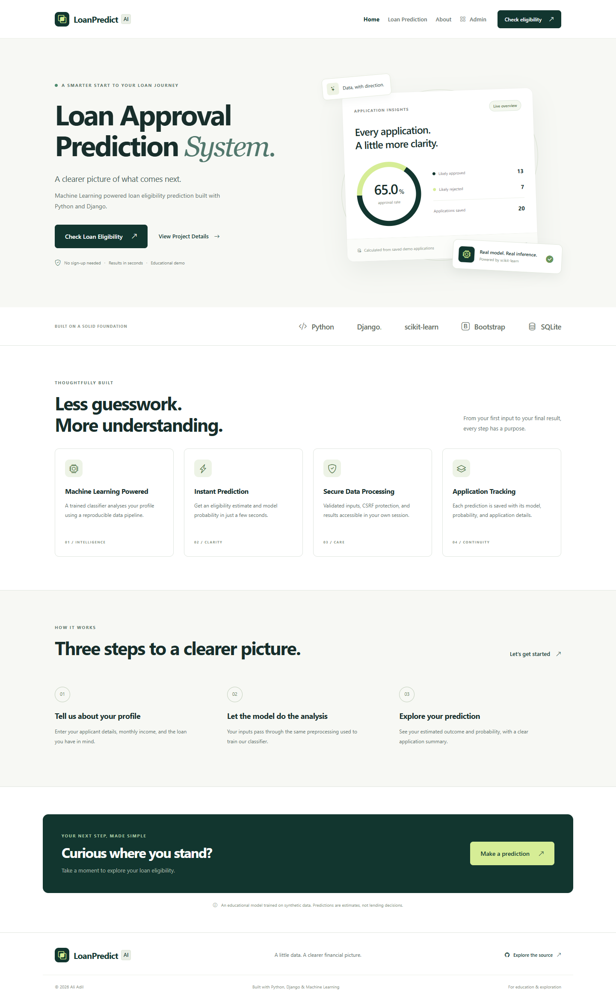
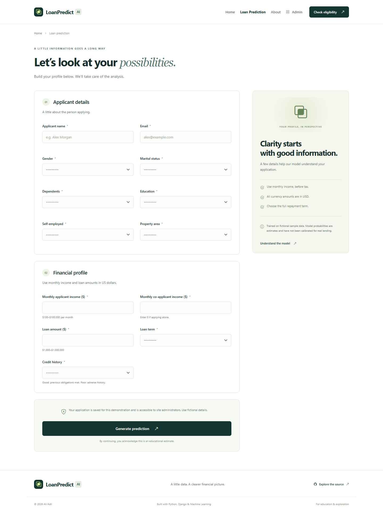
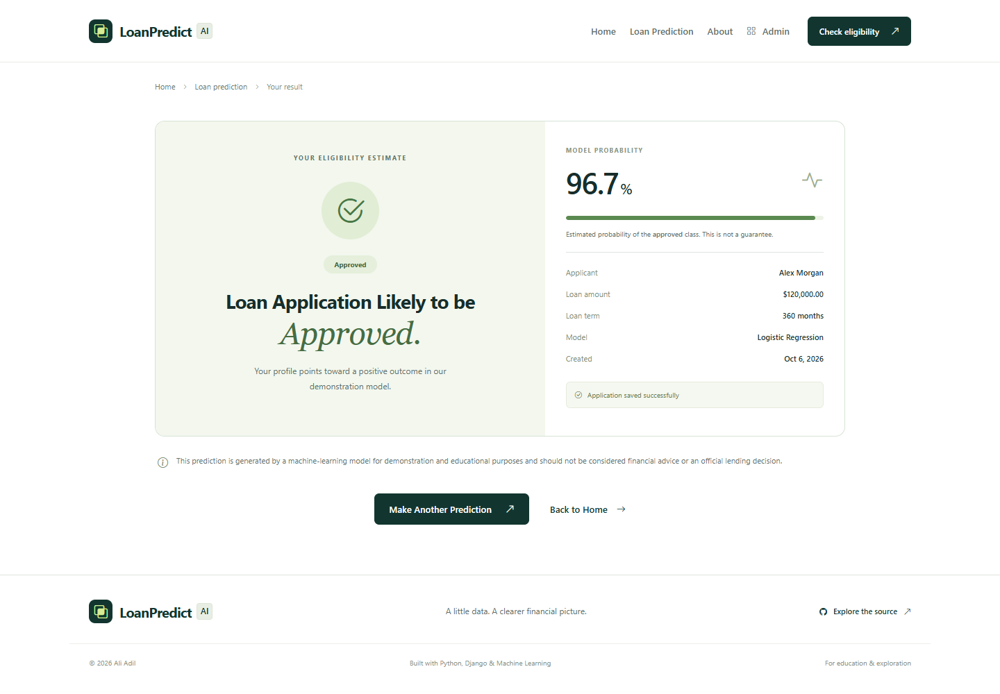
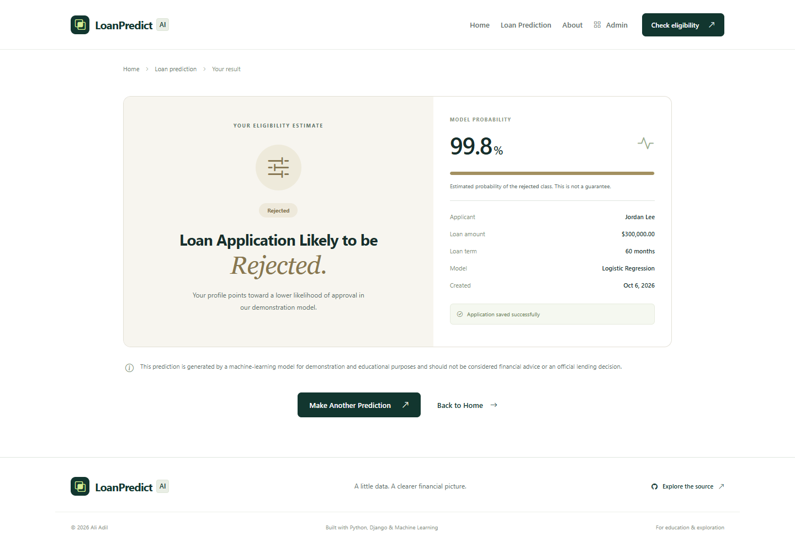
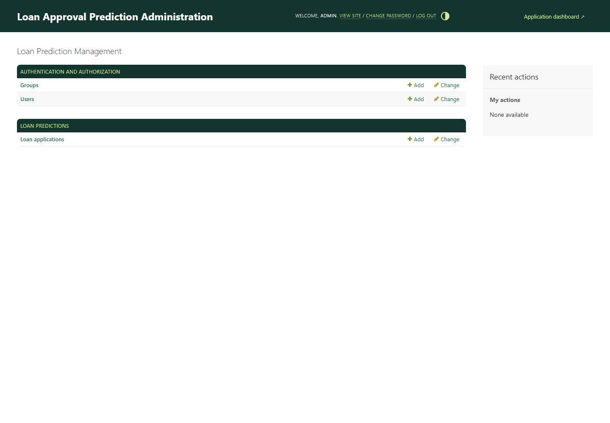
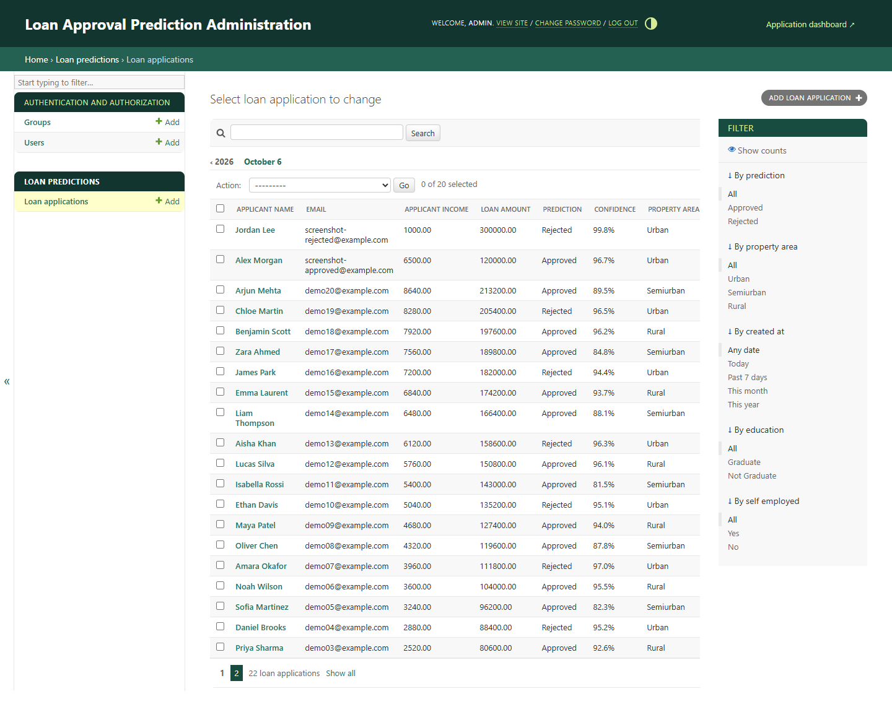
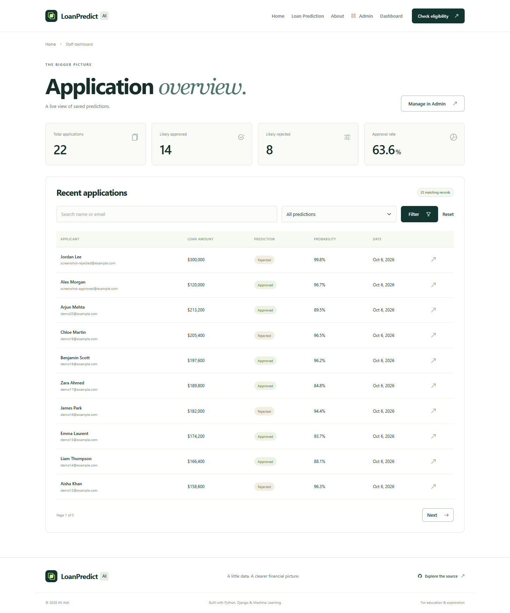

# Loan Approval Prediction


## Loan Approval Prediction

**LoanPredict AI** brings a complete machine-learning workflow into a polished Django web application. Enter a fictional applicant profile, receive an estimated approval or rejection with its model probability, and explore saved applications through a staff dashboard and Django Admin.

Developed by **Ali Adil** as a portfolio project demonstrating reproducible model training, validated inference, relational persistence, and thoughtful responsive design.

## Overview

The application uses a real scikit-learn classifier trained on an included **800-record synthetic educational dataset**. Inference comes from the serialized fitted model; it does not apply hard-coded approval rules. Every successful form submission is saved in SQLite with the outcome, probability, model name, and timestamps.

The interface uses a restrained green, navy, and cream finance-inspired design. Local Bootstrap and icon assets make the app usable without CDN requests. Predictions are private to the submitting browser session, while application management requires staff authentication.

**This is an educational demonstration, not a lending product.** The data is fictional, the probabilities are uncalibrated, and no real-world reliability or fairness claim is made.

## Demo / Screenshots

These are actual browser captures of the running Django application with seeded records and real model inference. No mockups or fabricated results are used.

### Home Page



### Prediction Form



### Approved Prediction



### Rejected Prediction



### Admin Dashboard



### Loan Applications Admin List



### Application Statistics Dashboard



A phone layout is also captured in [screenshots/home-mobile.png](screenshots/home-mobile.png).

## Features

- Real ML loan prediction with the predicted class probability.
- Complete Django application using models, migrations, forms, templates, and a dedicated inference service.
- Responsive UI with accessible labels, keyboard focus, mobile navigation, and reduced-motion support.
- Saved application history, private result pages, and a staff-only statistics dashboard.
- Customized Django Admin with search, status/property/date filters, sorting, edit, and delete support.
- Prediction recalculation when administrators edit application inputs.
- Twenty realistic fictional applications and an idempotent local demo account command.
- Server-side numeric bounds, email and category validation, client-side validation, and CSRF protection.
- Friendly model and database error messages without exposing internal details to visitors.
- Reproducible training with honest model comparison, held-out metrics, dataset checksum, and version metadata.
- A GitHub Actions workflow for install, training, migration checks, seeding, and tests; no unverified CI badge.

## Technology Stack

| Layer | Technologies |
| --- | --- |
| Frontend | HTML5, CSS3, JavaScript, Bootstrap 5.3.8, Bootstrap Icons 1.13.1 |
| Backend | Python, Django 5.2.17, Django ORM, Django Forms |
| Machine Learning | pandas 2.3.3, NumPy 2.2.6, scikit-learn 1.7.2, joblib 1.5.2 |
| Database | SQLite for development; environment-configurable PostgreSQL backend |
| Configuration | Environment variables and python-dotenv 1.1.1 |

Use Python **3.11–3.13**. Local verification was completed on Python **3.12.14**. Django's supported Python versions are documented in its [5.2 release notes](https://docs.djangoproject.com/en/5.2/releases/5.2/); this project recommends the narrower range above for its pinned ML packages.

## Project Structure

```text
loan_approval_prediction/
├── .github/workflows/tests.yml
├── .env.example
├── .gitignore
├── LICENSE
├── README.md
├── THIRD_PARTY_NOTICES.md
├── manage.py
├── requirements.txt
├── train_model.py
├── data/
│   ├── README.md
│   └── loan_data.csv
├── ml_models/
│   ├── README.md
│   ├── loan_model.joblib
│   └── metrics.json
├── ml_workflow/
│   ├── __init__.py
│   ├── dataset.py
│   └── schema.py
├── loan_project/
│   ├── __init__.py
│   ├── settings.py
│   ├── urls.py
│   ├── asgi.py
│   └── wsgi.py
├── predictor/
│   ├── migrations/0001_initial.py
│   ├── management/commands/seed_demo.py
│   ├── __init__.py
│   ├── admin.py
│   ├── apps.py
│   ├── forms.py
│   ├── models.py
│   ├── services.py
│   ├── tests.py
│   ├── urls.py
│   └── views.py
├── templates/
│   ├── admin/base_site.html
│   ├── partials/stat_cards.html
│   ├── base.html
│   ├── home.html
│   ├── predict.html
│   ├── result.html
│   ├── about.html
│   ├── dashboard.html
│   └── error.html
├── static/
│   ├── css/{style.css,admin.css}
│   ├── js/main.js
│   ├── images/favicon.svg
│   └── vendor/{bootstrap,bootstrap-icons}/
├── scripts/capture_screenshots.cjs
└── screenshots/
    ├── home.png
    ├── prediction-form.png
    ├── approved-result.png
    ├── rejected-result.png
    ├── admin-dashboard.png
    ├── applications-list.png
    ├── dashboard.png
    └── home-mobile.png
```

Python package directories also contain their required `__init__.py` files. The local virtual environment, `.env`, database, caches, and collected static files are excluded by `.gitignore`.

## Machine Learning Workflow

1. **Sample generation:** create 800 deterministic fictional applications using NumPy seed 42; preserve the existing CSV on normal training runs.
2. **Cleaning:** remove duplicate rows and missing targets; convert numeric columns and represent missing predictors for imputation.
3. **Preprocessing:** impute numeric values with training medians and categorical values with training modes.
4. **Encoding:** standardize numeric features and one-hot encode categories with unknown-category handling.
5. **Split:** reserve a stratified 20% test set: 640 training records and 160 test records.
6. **Model training:** compare Logistic Regression, Random Forest, and Decision Tree with five-fold training-only cross-validation. Each fold fits its own preprocessing, preventing data leakage.
7. **Evaluation:** select by mean cross-validation F1, then evaluate the selected classifier once on the untouched test set.
8. **Serialization:** save the complete preprocessing/classifier pipeline and metadata together in `ml_models/loan_model.joblib`.
9. **Django integration:** validated form inputs become a one-row pandas frame; a dedicated service loads the pipeline and returns class, probability, and model name.

The serialized classifier is kept fitted on the training split, so reported test metrics describe the exact model used by the website. Preprocessing is included in that artifact rather than saved as a separate file that could drift out of sync.

## Model Performance

**Selected model: Logistic Regression.** Actual measurements from the included dataset and training script:

| Metric | Held-out test result |
| --- | ---: |
| Accuracy | **81.88%** |
| Precision | **80.56%** |
| Recall | **91.58%** |
| F1 Score | **85.71%** |

Precision, recall, and F1 use **Approved** as the positive class. The test set contains **160** records.

| Candidate | Mean five-fold CV F1 | Standard deviation |
| --- | ---: | ---: |
| Logistic Regression | 0.8679 | 0.0303 |
| Random Forest | 0.8648 | 0.0315 |
| Decision Tree | 0.8339 | 0.0235 |

Confusion matrix, with rows = actual and columns = predicted:

| | Predicted Rejected | Predicted Approved |
| --- | ---: | ---: |
| Actual Rejected | 44 | 21 |
| Actual Approved | 8 | 87 |

Unrounded results, dataset SHA-256, feature order, and library versions are recorded in [ml_models/metrics.json](ml_models/metrics.json). These figures measure performance on synthetic data and do not establish suitability for real lending. Retraining on a different dataset changes the results; update this report accordingly.

## Installation

Install Python 3.11–3.13 and Git, then clone:

```bash
git clone https://github.com/AliAdilQ/loan_approval_prediction.git
cd loan_approval_prediction
```

### Windows (PowerShell)

```powershell
python -m venv .venv
.\.venv\Scripts\Activate.ps1
python -m pip install -r requirements.txt
Copy-Item .env.example .env
```

If activation is restricted, run commands with `.\.venv\Scripts\python.exe` in place of `python`; changing the system execution policy is unnecessary.

### Linux / macOS

```bash
python3 -m venv .venv
source .venv/bin/activate
python -m pip install -r requirements.txt
cp .env.example .env
```

### Configure and start

For local development, the example environment is ready to use. For a stable private secret, generate one with the following command and put it in your local `.env` as `SECRET_KEY`:

```bash
python -c "import secrets; print(secrets.token_urlsafe(64))"
```

The project also works without `.env` in development, generating an ephemeral secret. In that mode a server restart invalidates existing sessions. Never commit `.env`.

```bash
python train_model.py
python manage.py migrate
python manage.py seed_demo
python manage.py runserver
```

Open [http://127.0.0.1:8000/](http://127.0.0.1:8000/).

The fitted model is included, but the training command above verifies your installation and recreates it for your environment. Train before seeding if the artifact is absent. The initial migration is committed; `makemigrations` is only necessary after changing models.

## Demo Admin Credentials

| Setting | Value |
| --- | --- |
| Username | `admin` |
| Password | `Admin@12345` |
| Email | `admin@example.com` |
| Admin URL | [http://127.0.0.1:8000/admin/](http://127.0.0.1:8000/admin/) |
| Staff dashboard | [http://127.0.0.1:8000/dashboard/](http://127.0.0.1:8000/dashboard/) |

**These credentials are provided only for local demonstration. Change or remove them before deploying the application.**

`python manage.py seed_demo` creates the account only if it is missing and creates 20 model-backed applications identified by reserved `demoXX@example.com` addresses. Repeated runs preserve existing records, credentials, and permissions. It uses a database transaction and refuses to run when `DEBUG=False`. There is no authentication bypass. Use `python manage.py createsuperuser` for a production account.

## Example Prediction

The following fictional profile was verified with the included classifier:

| Field | Example |
| --- | --- |
| Applicant name / email | Alex Morgan / alex@example.com |
| Gender / married / dependents | Female / Yes / 0 |
| Education / self-employed | Graduate / No |
| Property area | Urban |
| Monthly applicant / co-applicant income | $6,500 / $1,800 |
| Loan amount / term | $120,000 / 360 months |
| Credit history | Good |

Choose **Check Loan Eligibility**, fill the form, and choose **Generate prediction**. With the shipped model, this profile returns **Approved**. The result page shows the measured class probability, applicant name, principal, term, and model. The database stores the application automatically; refreshing the result does not create a second record.

A poor-credit profile with $1,000 income, no co-applicant, a $300,000 loan, and a 60-month term was verified to return **Rejected**. These examples describe this exact synthetic model; they are not rules or financial guidance.

Results can be revisited in the submitting session (the last 50 results) or by authenticated staff. Other browser sessions receive a 404. Email and names are not shown in the public homepage overview.

## Dataset

The included CSV is a **generated educational sample**, not data from a bank or financial institution. It includes 800 records with income, co-applicant income, loan principal, term, credit history, gender, marital status, dependents, education, self-employment, property area, and `Loan_Status` (`Approved` / `Rejected`). All income is monthly USD and loan amounts are total USD principal.

The generator samples stochastic labels from an illustrative latent affordability score. Missing values are deliberately included in four predictors to exercise preprocessing. Gender and other demographic attributes are present as requested, but the model has not been assessed for fairness. See [data/README.md](data/README.md) for the full data dictionary, label-generation assumptions, and limitations.

## Training the Model

```bash
python train_model.py
```

The command loads the existing CSV (generating it if absent), compares classifiers, prints real accuracy/precision/recall/F1 and the confusion matrix, and saves the fitted pipeline and report. Normal training preserves your dataset. To replace it with the exact original synthetic sample:

```bash
python train_model.py --regenerate
```

Only load trusted local joblib files; Python serialization can execute code. Use the pinned scikit-learn version. Restart the server after retraining. Existing database entries retain their original prediction snapshot until staff edits trigger recalculation.

## Running Tests

```bash
python manage.py test
python manage.py check
python manage.py makemigrations --check --dry-run
```

The test suite covers page loads, valid/invalid forms, actual classifier output and both prediction outcomes, database persistence, duplicate-free result refreshes, result privacy, CSRF, model failures, idempotent seeding, production seed restrictions, admin search/filters, staff reporting, and custom error pages. Train the model first if it has been removed.

The repository includes `.github/workflows/tests.yml` to run training and tests on Python 3.11, 3.12, and 3.13 after upload. Local verification is distinct from future GitHub CI results.

### Recapture screenshots and verify the browser flows

This optional development tool requires Node.js and Playwright, not the running application itself:

```bash
npm install --prefix .verification playwright
npx --prefix .verification playwright install chromium
```

With the seeded Django server running, use PowerShell:

```powershell
$env:NODE_PATH = "$PWD/.verification/node_modules"
node scripts/capture_screenshots.cjs
```

Or Linux / macOS:

```bash
NODE_PATH="$PWD/.verification/node_modules" node scripts/capture_screenshots.cjs
```

The script captures all screenshots and checks actual form submissions, private results, admin filters, dashboard search, static assets, JavaScript errors, horizontal overflow, and mobile navigation at 1440px, 768px, and 390px. It creates two fictional screenshot applications per run. Optional environment variables are `SCREENSHOT_BASE_URL` (localhost only), `PLAYWRIGHT_EXECUTABLE_PATH`, `DEMO_ADMIN_USERNAME`, and `DEMO_ADMIN_PASSWORD`.

## Configuration and Deployment

`.env.example` documents `SECRET_KEY`, `DEBUG`, `ALLOWED_HOSTS`, and database settings. With `DEBUG=False`, a private random secret of at least 50 characters is required; HTTPS redirect, secure cookies, and HSTS are enabled. Configure your domain in `ALLOWED_HOSTS`, serve through a production WSGI/ASGI server, use HTTPS, collect static assets, and run Django's deployment checks:

```bash
python manage.py collectstatic --noinput
python manage.py check --deploy
```

The development server is for local use. A production setup also needs appropriate privacy/retention policies and application-level abuse prevention. Do not put this synthetic model into real lending operations.

For PostgreSQL, install an appropriate `psycopg` driver, set `DATABASE_ENGINE=django.db.backends.postgresql` and the `DATABASE_NAME`, `DATABASE_USER`, `DATABASE_PASSWORD`, `DATABASE_HOST`, and `DATABASE_PORT` environment variables, then run migrations. The models and service do not rely on SQLite-specific queries. PostgreSQL deployment is an extension point and was not tested in this build.

## Future Improvements

- PostgreSQL deployment, Docker packaging, and production hosting.
- Authenticated applicant accounts with durable application history and retention controls.
- REST API and optional React client.
- A properly sourced, consented real-world dataset and external validation.
- Probability calibration, explainability with SHAP, and documented fairness evaluation.
- More advanced models assessed against honest baselines.

## Disclaimer

This project is for **educational purposes, portfolio demonstration, and machine-learning practice**. Predictions from this fictional dataset are **not financial advice or official bank decisions**. Reported accuracy does not establish real-world lending suitability. Sensitive features and synthetic label assumptions require careful bias assessment before any practical adaptation.

## Author

### Ali Adil

- GitHub: [AliAdilQ](https://github.com/AliAdilQ)
- Repository: [loan_approval_prediction](https://github.com/AliAdilQ/loan_approval_prediction)

## License

Released under the [MIT License](LICENSE), © 2026 Ali Adil. Vendored frontend licenses are listed in [THIRD_PARTY_NOTICES.md](THIRD_PARTY_NOTICES.md).
